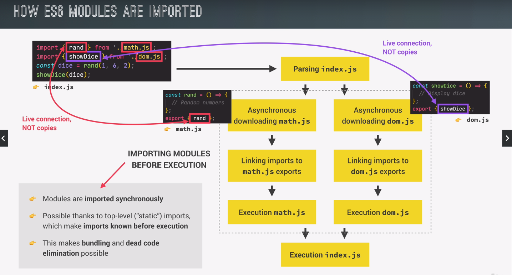

# Modules

- Reusable piece of code that encapsulates implementation details
- It is usually a standalone file, but it doesn't have to be
- It can have imports (imports other modules) and exports (export values from inside the modules to make it accessible to other modules)
- Imports are also called dependencies of an importing module
- ES6 Modules are stored in files, exactly one module per file

## Difference between script and module files

- All top level variables are scoped to the module, means that the variable declared inside a module is not accessible outside the module until it is exported. They are private to the module by default. In script file all the top level variable are global scoped. This can cause global namespace pollution where multiple script files tries to declare variables with the same name and then these variables collide

- ES modules are always executed in strict mode while scripts are executed in sloppy mode.

- The this keyword is always undefined at the top level while in the scripts the this keyword points to the window object

- We can export & import values in modules but not in the script files

\*\* All imports are hoisted and moved to the top of the file

- To link a module file in the html we will use type="module"

- File downloading in ES6 is done asynchronously but in scripts it is synchronous

## How ES6 modules are imported

First we parse the code synchronously then downloading modules happens async after which they are executed, after that they are imported synchronously in main index.js file

Only the importing operation is what happens synchronously. Downloading these modules from the server happens asynchronously.

When a value is imported from one module to another, the imported module remains connected to the original value in the source module.

This connection is "LIVE" (not a copy of the original value) because any changes to the original value in the source module will be reflected in the imported value in the destincation module in real-time.

// moduleA.js
export let count = 0;

export function increment() {
count++;
}

// moduleB.js
import { count, increment } from './moduleA.js';

console.log(count); // Outputs: 0
increment();
console.log(count); // Outputs: 1

### LIVE CONNECTION

The live connection means that the imorted `count` in `moduleB.js` is directly linked to the `count`
in `moduleA.js`. Any changes made to `count` in `moduleA.js` (such as calling `increment()`) will be reflected in `moduleB.js` because the import is a reference to the original value, not a copy

### TOP LEVEL AWAIT IN ES2022

We can use await keyword outside async functions at the top level of our modules. This feature was introduced in
ES2022. It only works in modules.

### THE MODULE PATTERN

Before ES6 modules were introduces, the module pattern in js was a design pattern used to emulate
the concept of classes and private/public scope. It allows developers to create modules that encapsulates
data and functions, providing a public interface while hiding the internal implementation details.

Here's a basic outline of how the module pattern works:

1. IIFE (Immediately invoked function expression)
   The module pattern typically uses an IIFE to create a new scope. This ensures that variable and functions defined inside a module
   are not accessible from the global scope

2. Private variable and functions
   Variable and functions defined inside the IIFE are private to the module. They can not be accessed directly from outside the module

3. Public API
   The module exposes a public API by returning an object containing methods and properties that should be accessible from the
   outside of the module

#### Example

const shoppingCart2 = (function () {
const cart = [];
const shippingCost = 10;
const totalPrice = 237;
const totalQuantity = 23;

const addToCart = (product, quantity) => {
cart.push(product);
console.log(
`${quantity} ${product} added to the cart (shipping cost is ${shippingCost})` // closure
);
};

const addStock = (product, quantity) => {
cart.push(product);
console.log(`${quantity} ${product} order from supplier`);
};

return {
addToCart,
cart,
totalPrice,
totalQuantity,
};
})();

shoppingCart2.addToCart('apples', 4);
shoppingCart2.addToCart('pizza', 4);
console.log(shoppingCart2.shippingCost); // not accessible

### Working with command line

1. cd (change directory)
2. dir (list all folders in the current directory)
3. new-item name (add new file)
4. new-item name -item-type directory (add new folder)
5. remove-item name (remove file / folder)
6. mv filename location-to-move-the-file (move file into a directory)

### Introduction to NPM (Node package manager)

It is both a software program and a package repository.

- npm init (add npm to the project, creates a package.json file that contains all deps)
- npm i package-name
- npm i package-name --save-dev (used to build our application not imported/used in our project)

#### Installing Lodash

This library uses commonjs module system that will need a bundler to
function properly. We will install lodash-es (ES Modules) package

### Bundling with Parcel and NPM scripts

[What is bundler anyways](https://dev.to/sayanide/the-what-why-and-how-of-javascript-bundlers-4po9)

// start parcel bundle
// npx parcel index.html

// this will do hot module replacement will update the page
// without reloading and maintaining our state
if (module.hot) {
module.hot.accept();
}
